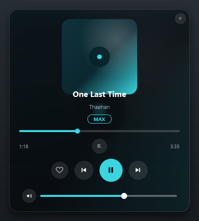
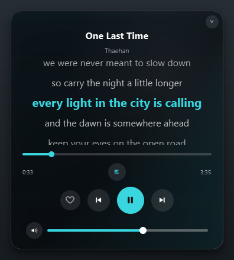
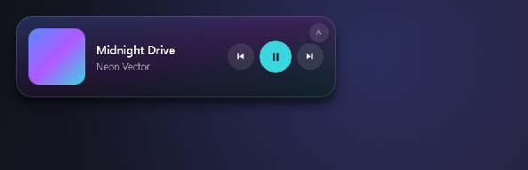

# TIDAL Now-Playing Widget

A polished "dark glass" desktop widget for Windows that shows what's currently
playing on **TIDAL** (cover art, title, artist) with transport controls, a
compact/expanded view, and a system-tray menu. It reads playback straight from
Windows media controls, so seeing what's playing works the moment TIDAL plays,
no API keys and no setup. Signing in is only needed for the optional extras
(liking tracks and the quality badge).


<p align="center">
  
  
</p>
<p align="center">
  
</p>

> **Disclaimer:** This is an unofficial, third-party tool. It is not affiliated
> with, endorsed by, or sponsored by TIDAL or Aspiro AB. "TIDAL" is a trademark
> of its respective owner and is used here only to describe compatibility.

## Features

- Live cover art, title, and artist, updating within about half a second of a track change
- Play / pause, next, and previous controls
- Compact bar and expanded card, toggled by button, double-click, or tray menu
- Blurred album-art ambient background for the signature "dark glass" look
- Configurable transparency and accent color, with optional auto-accent tinted from the album art
- Seekable progress bar (drag to scrub) in the expanded view
- Shuffle and repeat toggles, shown when the current source supports them
- System-tray icon with full controls and quit
- Volume slider (in both the compact bar and the expanded card) for the playing app, via Windows Core Audio, with a mute toggle and a system-volume fallback
- Synced (karaoke) lyrics in the expanded view: the active line fills with the accent color in time with the vocal (a karaoke "wipe"), auto-scrolls, and you can click a line to seek. Countdown dots show when the next line lands after an instrumental break. Scroll to nudge the timing when a track's lyrics drift (middle-click resets). Right-click to copy a line or the whole lyric. Tracks with only plain (unsynced) lyrics show them as a scroll-through block. From LRCLIB (free); a dimmed lyrics button signals when a track has none
- Heart button to favorite the playing track to your TIDAL collection, or un-favorite one that is already in it (the heart reflects your real collection when signed in). Right-click the heart to add the track to any of your TIDAL playlists (or a new one). Optional, one-time sign-in
- Fullscreen "now playing" mode (tray menu): a big blurred-cover wash with room-scale karaoke lyrics
- Optional integrations (Settings, all off by default): Discord Rich Presence ("Listening to TIDAL"), ListenBrainz scrobbling, and a localhost OBS now-playing overlay
- Track radio: open a TIDAL mix seeded from the playing song ("more like this"), from the tray or right-click menu (needs sign-in)
- Full-res cover art: when signed in, the small system thumbnail is silently swapped for TIDAL's high-resolution cover, and "Save cover art..." saves it to disk
- Duotone accent: with auto-accent on, the play button and progress bar carry a two-color gradient sampled from the album art
- Game mode: the widget hides itself while a fullscreen app (game, video) owns its monitor, and comes back after (can be turned off)
- Live tray icon: the tray shows the current album art with a progress ring and dims while paused (can be turned off)
- Album art dims while playback is paused, so you can read play state at a glance
- Single instance with CLI verbs: `TidalNowPlaying.exe --cmd next` (or `playpause`, `prev`, `like`, `show`, `hide`, `toggle`, `expand`) controls the running widget, ready for Stream Deck or AutoHotkey; a bare second launch just surfaces it
- Quality badge showing what the track is available in on TIDAL (MAX / Hi-Res / Lossless / High, plus Atmos)
- Adaptive controls: actions the current source doesn't support are greyed out or hidden
- Preferences dialog (with an About + licenses tab), run-at-Windows-startup, and optional global hotkeys
- Optional in-app update check: notified of new releases and updated with one click (HTTPS download, SHA-256 verified, can be turned off)
- Frameless, always-on-top, and stays out of the taskbar
- Drag to reposition; locks into the nearest screen corner on release
- Ships as a single standalone `.exe`, no Python needed to run it

## How it works

The widget reads the active session from the Windows **System Media Transport
Controls (SMTC)**, the same mechanism behind the volume-flyout media controls.
Any app that integrates with SMTC publishes its now-playing metadata and accepts
transport commands through it, including the TIDAL desktop app. So the now-playing
display needs no OAuth or API keys and works the moment TIDAL is playing. If TIDAL
is not running, it can optionally follow whatever else is playing (Spotify, a
browser, and so on). The optional heart/quality features are separate and do use a
one-time TIDAL sign-in (see below).

## Requirements

- Windows 10 or 11
- The TIDAL desktop app, or the built-in **TIDAL web player** option (opens in Edge/Chrome)
- Only to run from source or build it yourself: Python 3.10+ (the prebuilt `.exe` needs neither)

## Get it

### Option A: Download the .exe (easiest)

1. Download the latest `TidalNowPlaying.exe` from the
   [Releases](https://github.com/gullyous/Tidal-Widget/releases/latest) page.
2. Open TIDAL and play a track.
3. Double-click the `.exe`. The first launch takes a few seconds while it unpacks.

The app is unsigned, so Windows SmartScreen may show a warning the first time.
Click **More info -> Run anyway**, or build it yourself (below) if you prefer.

### Option B: Run from source

1. Install Python 3.10+ (tick **Add Python to PATH**).
2. Open TIDAL and play a track.
3. Double-click **`run.bat`** (it creates a virtual environment, installs
   dependencies, and launches). Use **`run-debug.bat`** to see logs and a
   backend self-test.

## Build your own .exe

Double-click **`build.bat`**, or run:

```bat
pip install -r requirements.txt pyinstaller
python make_icon.py
pyinstaller --noconfirm --clean TidalNowPlaying.spec
```

The result is `dist\TidalNowPlaying.exe`.

## Usage

- **Move it:** drag anywhere on the card; on release it locks into the nearest screen corner.
- **Resize:** double-click the card, or use the chevron in the top-right corner, to switch between compact and expanded.
- **System tray:** left-click the tray icon to show or hide the widget; right-click for the full menu (current track, play/pause, next, previous, like, Open TIDAL, check for updates, show/hide, expand/compact, Settings, and quit).
- **Right-click the widget:** the same management actions (Settings, Open TIDAL, check for updates, sign in, hide, expand/compact, quit), without the transport controls, since those are already buttons on the widget.
- **TIDAL web player:** the tray/right-click menu's **TIDAL web player** item opens listen.tidal.com as a standalone window (via Edge/Chrome). Handy if you don't have the desktop app, the widget reads it through Windows media controls, so keep **Follow other apps** on.
- **Seek:** in expanded mode, drag the progress bar to jump to any point in the track.
- **Volume:** a slider under the compact controls (and in the expanded card, with a mute button). By default it controls the **Windows system volume**, so it moves in lock-step with your keyboard volume keys and the taskbar speaker. In **Settings** you can switch it to control **only the playing app's volume** (TIDAL, or your browser for the web player), the way the Windows Volume Mixer's per-app slider does; in that mode it shows the effective (audible) level and follows the system master as its ceiling. It appears only while something is playing.
- **Lyrics:** when the current track has lyrics, a lyrics button lights up (on both the compact bar and the expanded view). Tap it for a karaoke view: the active line fills with the accent color in time with the vocal, auto-scrolls, and you can click any line to seek. During a long instrumental break, three countdown dots drain down so you know when the next line lands. If the timing drifts, scroll on the panel to nudge it earlier or later (a small "sync +0.3s" badge shows the amount; middle-click resets). Tracks that only have plain (unsynced) lyrics show them as a scroll-through block. The button dims when a track has no lyrics.
- **Remote control / Stream Deck:** the exe is single-instance and takes command verbs: `TidalNowPlaying.exe --cmd playpause` (also `next`, `prev`, `like`, `show`, `hide`, `toggle`, `expand`) controls the already-running widget and exits. Point a Stream Deck "Open" action or any launcher at it. Launching the exe again with no arguments just brings the running widget to the front.
- **Shuffle / repeat:** toggle buttons appear in expanded mode when the player supports them. (TIDAL does not expose shuffle/repeat to Windows, so they stay hidden for TIDAL.)
- **Settings:** right-click the tray icon (or the widget) and choose **Settings...** for accent (and **tint accent from album art**), opacity, refresh interval, run-at-startup, hotkeys, and update checks. An **About** tab shows the version, links, and licenses.
- **Global hotkeys** (when enabled): Ctrl+Alt+Space play/pause, Ctrl+Alt+Left/Right prev/next, Ctrl+Alt+L like, Ctrl+Alt+H show/hide.
- **Heart (like):** click the heart to add the current track to your TIDAL collection. The first time, sign in once via the tray menu ("Sign in to TIDAL"). See below.

## Liking tracks (TIDAL collection)

The heart adds the current track to your TIDAL collection (favorites). Because
Windows media controls have no "favorite" command, this talks to TIDAL directly:

- **One-time sign-in:** right-click the tray icon and choose **"Sign in to TIDAL"**.
  A TIDAL page opens in your browser; approve it once. The login token is stored
  locally in `%APPDATA%\TidalWidget\` and refreshed automatically, so you never
  sign in again. Nothing is sent anywhere except to TIDAL.
- **Click the heart** to add the playing track; click again to remove it. The
  heart fills in to show it's in your collection.
- **Matching:** the now-playing track is matched to TIDAL's catalog by title and
  artist. If it cannot find a confident match it tells you rather than guessing.
- This feature is **optional**: it needs the `tidalapi` package (bundled into the
  `.exe`). Without it, the heart simply prompts you to sign in.

### Track quality

The expanded card shows a badge for the best quality the current track is
**available in** on TIDAL (MAX, Hi-Res, Lossless, High, plus an Atmos tag). It
needs the same sign-in and title/artist match as the heart.

Important: this is **catalog availability, not the quality you are currently
streaming**. Windows and TIDAL do not expose the live stream quality to other
apps, and the actual streaming quality can only be changed inside TIDAL itself
(use "Open TIDAL" in the menu, then TIDAL > Settings > Streaming).

## Configuration

Most of these are editable live from the tray **Settings...** dialog (saved per-user
and remembered across launches). `config.py` holds the defaults; edit it and relaunch
if you prefer.

| Setting | Default | What it does |
|---|---|---|
| `MATCH_APP` | `"tidal"` | Which app's session to follow (matched against the app id). |
| `FALLBACK_TO_ANY` | `True` | If TIDAL is not playing, follow any other player (Spotify, a browser, etc.). |
| `POLL_MS` | `500` | How often to refresh now-playing info, in milliseconds. |
| `VOLUME_SCOPE` | `"system"` | What the volume slider controls: `"system"` (the Windows master, like your volume keys) or `"app"` (only the playing app's own volume). |
| `ACCENT` | `"#39d6e0"` | Accent color for the play button and progress bar. |
| `AUTO_ACCENT` | `False` | Tint the accent from the album art instead of the fixed color above. |
| `LYRICS_OFFSET` | `0.0` | Seconds to shift synced lyrics (+ earlier, - later). Nudge it live by scrolling on the lyrics panel; remembered across runs. |
| `START_EXPANDED` | `False` | Start in the larger expanded card. |
| `HIDE_ON_FULLSCREEN` | `True` | Game mode: hide while a fullscreen app owns the widget's monitor. |
| `LIVE_TRAY` | `True` | Live tray icon: album art + progress ring instead of the brand mark. |
| `ALWAYS_ON_TOP` | `True` | Keep the widget above other windows. |
| `BACKGROUND_OPACITY` | `0.82` | Panel transparency (0.0 = clear, 1.0 = solid); text and controls stay opaque. |
| `WINDOW_OPACITY` | `1.0` | Fade the entire widget, text included. Lower for a fully ghosted look. |
| `HOTKEYS_ENABLED` | `True` | Enable system-wide global hotkeys (needs `pynput`). |
| `CHECK_UPDATES` | `True` | Check GitHub for a newer release on startup, and enable the "Check for updates..." menu item. |

## Project structure

| File | Role |
|---|---|
| `main.py` | Entry point; wires the backend worker to the widget. |
| `widget.py` | The UI: card, compact/expanded modes, tray icon, transparency. |
| `media_backend.py` | SMTC reader and transport (play/pause/next/prev/seek/shuffle/repeat), on a worker thread. |
| `tidal_likes.py` | Optional TIDAL favorites (heart): OAuth login + add/remove, on background threads. |
| `icons.py` | Transport and app icons drawn at runtime with QPainter. |
| `config.py` | Default user settings (see above). |
| `settings.py` | Persisted settings (QSettings) + run-at-startup management. |
| `settings_dialog.py` | The preferences dialog. |
| `hotkeys.py` | Optional global hotkeys (pynput). |
| `updater.py` | Optional in-app update check + self-replace install (GitHub releases). |
| `volume_backend.py` | Optional per-app volume control via Windows Core Audio (pycaw), on its own COM thread. |
| `lyrics_backend.py` | Optional synced lyrics from LRCLIB, on a background thread. |
| `fullscreen_watch.py` | Game mode: detects a fullscreen app on the widget's monitor (user32 via ctypes). |
| `make_icon.py` | Generates `icon.ico` for the packaged app. |
| `build.bat` | One-click build of the standalone `.exe`. |
| `run.bat` / `run-debug.bat` | Run from source (with or without a console). |
| `requirements.txt` | Python dependencies (PySide6, winsdk, tidalapi, pynput, pycaw). |

## Troubleshooting

- **"Nothing playing":** open TIDAL and press play. SMTC only reports while a media session exists.
- **Can't find the window:** by design it has no taskbar button. Use the tray icon (left-click to show), or it sits in the bottom-right corner by default.
- **SmartScreen / antivirus warning:** expected for an unsigned PyInstaller binary. Use **More info -> Run anyway**, or build it yourself.
- **Need logs:** run `run-debug.bat`, or `python media_backend.py` to print the current track and album-art byte count.

## Updates and privacy

The widget can check for new versions on startup. This is on by default and can
be turned off in Settings (the "Check for updates on startup" option).

When the check runs, it contacts GitHub's API for this repository
(gullyous/Tidal-Widget) over HTTPS. This sends your app version and exposes your
IP address to GitHub; no other data is collected or sent. The check runs at most
once per launch.

If an update is found, the new program is downloaded over HTTPS from this
project's GitHub release and, when a `SHA256SUMS.txt` is published in the same
release, its SHA-256 checksum is verified before anything runs. The checksum
protects against corrupted or tampered downloads in transit; it does not by
itself prove the release was published by the project owner. The app never
installs silently: you are always prompted, and you can skip any version.

Note: current builds are not code-signed, so Windows SmartScreen may show an
"unknown publisher" warning. Authenticode signing is planned to address this.

## Tech and acknowledgements

- [PySide6](https://doc.qt.io/qtforpython/) (Qt for Python), licensed under LGPLv3
- [winsdk](https://github.com/pywinrt/python-winsdk) (Python WinRT projection), licensed under MIT
- [tidalapi](https://github.com/tamland/python-tidal) (unofficial TIDAL API client) for the optional favorite feature, licensed under LGPLv3
- [pynput](https://github.com/moses-palmer/pynput) for optional global hotkeys, licensed under LGPLv3
- [pycaw](https://github.com/AndreMiras/pycaw) for the optional per-app volume control (Windows Core Audio), licensed under MIT
- [LRCLIB](https://lrclib.net) for free, keyless time-synced lyrics
- Icons are drawn at runtime with QPainter, so there are no image assets to ship

Because the packaged `.exe` bundles PySide6 (LGPLv3), the full source for this
project is published here so the Qt components remain replaceable, as LGPL
intends.

## Credits

Made by **[gullyous](https://github.com/gullyous)**.

## License

Released under the **GNU General Public License v3.0**. See the [LICENSE](LICENSE)
file for the full text.

This is free software: you can redistribute it and/or modify it under the terms
of the GPL, version 3 or (at your option) any later version. It comes with no
warranty. Versions up to and including 1.0.0 were released under the MIT License.
